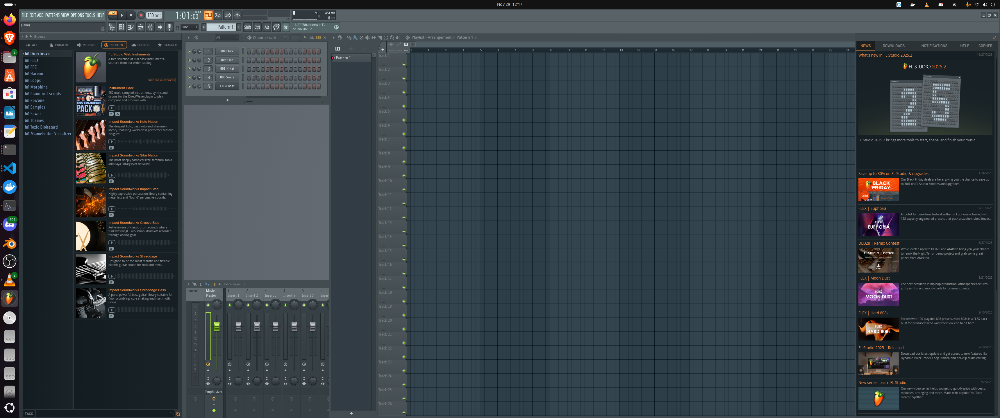
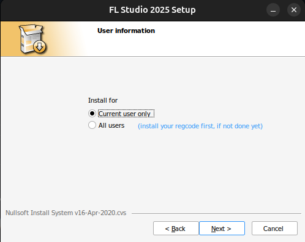
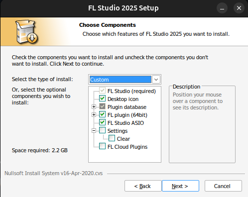
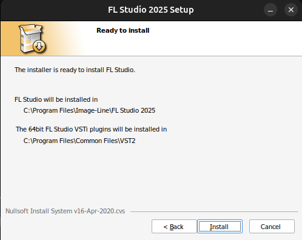
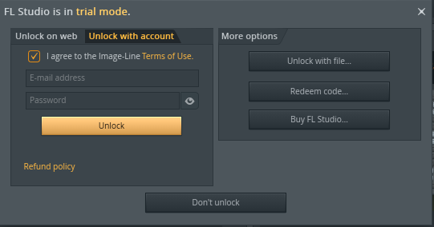

# FL Studio on Linux — One-Command Installer/Updater & Optional AI-Ready Tool‑chain


**TL;DR** Run a single configurable one-shot shell script or command to get:

* **AI-capable (or any vanilla version) of `FL Studio Running on Linux!`** (auto-downloads the [latest FL Studio installer](https://install.image-line.com/flstudio/flstudio_win64_25.2.0.5125.exe ) or uses your already downloaded .exe installation file)
* Wine 10.x **staging** or **stable** (you choose via `--wine`) + `WineASIO` + `Winetricks` to make [FL Studio](https://www.image-line.com/fl-studio ) work at full capacity on Linux
* Automatic 32bit architecture enabled for older FL Studio and third party VST components
* `Yabridge` for Windows `VST`/`VST3`/`CLAP` plugins
* `PipeWire`/`JACK` low‑latency audio *and* an `ALSA` ↔ `JACK` *LoopMIDI‑style* bridge (`a2jmidid`)
* **Additional and Unofficial AI-ready toolchain**: My fork of the community‑maintained [**flstudio‑mcp**](https://github.com/BenevolenceMessiah/flstudio-mcp ) server, plus optional [**n8n**](https://n8n.io/ ), [**Ollama**](https://ollama.com/ ), [**Continue**](https://www.continue.dev/ ) and [**Cursor**](https://cursor.com/ ) endpoints for (unofficial) [MCP](https://en.wikipedia.org/wiki/Model_Context_Protocol ) AI integration!
* Automatic Installation and updates for `flstudio‑mcp`, `n8n` and MCP node and `Ollama` MCP file, all the Linux dependencies, graphics, and runtimes components, etc., and `FL Studio` itself
* Auto‑generated **Continue** MCP assistant YAML files (safe even if you still use the old `config.json`) auto‑generated **Ollama** MCP assistant, auto‑generated **n8n** MCP assistant, auto-generated **Cursor** MCP assistant.
* Optional user-level systemd services so everything starts at login **and survives logout** via `loginctl enable-linger`
* One-command **uninstaller** (`--uninstall` and `--uninstall-full`) that removes packages, Wine prefix, user services, and desktop entries, and even project files if you so desire (`--uninstall-full`)
* Automatic FL Studio icon integration with GNOME/KDE menus **and** optional registry tweak (`--disable-fl-updates`) to silence the auto-update popup
* **PATH Launcher** Add the `--path` command line argument to the installation in order to be able to launch FL Studio from the terminal via `fl-studio` command.
* **WebView2 workaround** with `--hide-broken` flag to disable non-functional tabs
* **Project preservation** during uninstall with `--preserve-projects`

Re‑run the script/command any time with the same command line flags — it upgrades everything in place.

**Don't own FL Studio?** Not a problem! This script installs the official installer - FL Studio's Trial Mode will allow you to play with pretty much the full program; the main limitation is that you can't reopen your saved projects.



---

## Table of Contents

1. [Quick Start](#quick-start)
2. [Why This Exists](#why-this-exists)
3. [Prerequisites & Supported Distros](#prerequisites--supported-distros)
4. [Installation Methods](#installation-methods)
5. [Flags & Environment Variables](#flags--environment-variables)
6. [What the Script Actually Does](#what-the-script-actually-does)
7. [MCP Stack Deep-Dive](#mcp-stack-deep-dive)
8. [Updating, Re-running & Uninstalling](#updating-re-running--uninstalling)
9. [Current Issues and Limitations](#current-issues-and-limitations)
10. [Roadmap and Future Updates](#roadmap-and-future-updates)
11. [Troubleshooting](#troubleshooting)
12. [Credits & License](#credits--license)

---

## Quick Start

- Open a terminal and customize/run one of the following commands:
- Follow any terminal based, System pop-up, and Windows Installation Wizard popups accordingly

### Recommended for Most Users

```bash
# minimal install (FL Studio + WineASIO only) - fastest option for basic setup
curl -fsSL https://raw.githubusercontent.com/BenevolenceMessiah/flstudio_setup/main/flstudio_setup.sh   | bash -- --no-features
```

Prior to running this, it is advisable to read onward, specifically as it concerns additional parameters and command line flags. Append your installation command accordingly. I personally like to add the `--path` argument in order to be able to additionally launch FL Studio from the CLI using the `fl-studio` command:

```bash
# minimal install (FL Studio + WineASIO + PATH integration only) - fastest option for basic setup
curl -fsSL https://raw.githubusercontent.com/BenevolenceMessiah/flstudio_setup/main/flstudio_setup.sh   | bash -- --no-features --path
```

### Recommended for Users Who Already Have the FL Studio .exe File

This method is useful if you're using an older version of FL Studio for compatibility and you already have the installer locally on the computer.

Simply point the installer script to your installer file via (`--installer`) and (optionally) to a reg key file (`--reg`) - you can always unlock FL Studio the recommended/normal way once the program is up and running so the `--reg` command line flag is completely optional when using the `--installer` command line flag.

Notably, the `--installer` command line argument also accepts `URLs` in the event you need to pull a version-specific `.exe` file from ImageLine servers directly. This means you could also use any URL or remote server location where an FL Studio installer .exe file hosted/backed up.

```bash
# minimal install with offline/URL installation and activation
curl -fsSL https://raw.githubusercontent.com/BenevolenceMessiah/flstudio_setup/main/flstudio_setup.sh   | bash -- --no-features --installer /absolute/path/to/flstudio.exe --reg /absolute/path/to/flstudio.reg
```

### Examples for Users Seeking Advanced AI Features and Options

```bash
# lean install (Wine + Yabridge + MCP + LoopMIDI bridge) + autostart services - (recommended if you already have VS Code and the Continue Extension installed)
curl -fsSL https://raw.githubusercontent.com/BenevolenceMessiah/flstudio_setup/main/flstudio_setup.sh   | bash -- --systemd
```

```bash
# full installation with all AI features and services and multiple (unnecessary?) AI endpoints and integrations
ENABLE_N8N=1 ENABLE_OLLAMA=1 ENABLE_CURSOR=1 \
curl -fsSL https://raw.githubusercontent.com/BenevolenceMessiah/flstudio_setup/main/flstudio_setup.sh   | bash -- \
  --systemd
```

```bash
# custom installation with specific components
curl -fsSL https://raw.githubusercontent.com/BenevolenceMessiah/flstudio_setup/main/flstudio_setup.sh   | bash -- \
  --installer /absolute/path/to/flstudio_win_21_1_99.exe \
  --reg /absolute/path/to/flstudio.reg \
  --wine stable \
  --ollama-model llama3 \
  --systemd \
  --tweak-pipewire \
  --disable-fl-updates
```

### **Notes 1:**

1. *The first run takes \~5–20 minutes depending on bandwidth, what you chose to install, and what you already have installed; subsequent runs only fetch updates.* I have significantly cleaned up the aesthetic and verbosity of the script. This script is 1,600+ lines long presently, and the base installation should work fine. DAWs are notoriously difficult to set up on Linux.
2. *If you're using a pre-downloaded EXE file for FL Studio, make sure you edit the file location via `--installer` when you paste the command. You can optionally add `--reg` for your reg key file too at this point or you can manually unlock inside of FL Studio*
3. The script **auto‑downloads the latest FL Studio installer** if you omit `--installer`.
4. *Read on for all available command line arguments and features!*
5. Tested with installing for `Current User`. I suggest this is what you do too.
6. Registering/Unlocking FL Studio is still a bit wonky in `version 2.0.0` but you have a few options (either using the offline .reg file and using the `--reg` command line argument or using the file unlock option via the FL Studio authentication dialog (recommended)).
7. The MCP and AI integrations are all experimental and largely untested. Your results may vary!
8. If you receive any network errors or timeouts, it's moat likely due to a slow/flaky internet connection - the script is designed to stop hangups, so if it exits during a download of the installer from ImageLine, add `--no-timeout` as a command line argument to your installation i.e.

```bash
curl -fsSL https://raw.githubusercontent.com/BenevolenceMessiah/flstudio_setup/main/flstudio_setup.sh   | bash -- --no-features --path --no-timeout
```

9. Add `--path` as a command line argument if you want to be able to launch FL Studio directly from any terminal.
10. I have not tested `FL Cloud Plugins` they should work though, but note that (as I recall), the current ImageLine policy is that you get 3x Cloud Plugins installations per FL Studio subscription. I don't recommend installing the FL Cloud Plugins unless you plan to make this FL Studio Ubuntu installation one of your main DAW installations.
11. Recommended GUI settings:





12. Recommended registration method:



---

## Why This Exists

Running **FL Studio** on Linux has always meant juggling Wine versions, Winetricks DLLs, WineASIO, Windows VST bridges, etc. - and now in the case and era of MCP, it means also necessarily setting up a virtually‑patched MIDI loopback, and dumping Python files into FL Studio's installation and otherwise configuring AI MCP servers; and thus the advent of integrating agentic AI musician assistants is here!
This script wires everything necessary together *idempotently*: every section checks for an existing install and upgrades rather than overwriting.

* Wine repository setup follows the **new keyring‑in‑`/etc/apt/keyrings/`** guide so `apt update` stays warning‑free.
* WineASIO gives near‑native latency by exposing JACK to FL’s ASIO engine.
* DXVK + `vcrun2019` via Winetricks solve most modern graphics/runtime issues.
* **Yabridge** translates Windows plugins to native hosts and auto‑re‑syncs after a Wine update.
* **a2jmidid -e** is the de‑facto "LoopMIDI" for JACK/PipeWire.
* **Model Context Protocol (MCP)** turns FL Studio into an AI‑controllable endpoint—the "USB‑C of AI apps." To this end, since FL Studio doesn't have an official Linux install, and since this project is presumably the most comprehensive attempt at perpetuating a long term future-proof solution, it ships out of the box with AI capabilities.

---

## Prerequisites & Supported Distros

| Works on                           | Tested | Notes                                                                        |
| ---------------------------------- | ------ | ---------------------------------------------------------------------------- |
| Ubuntu 22.04 / 24.04 & derivatives | ✅      | PipeWire is default; JACK sessions also supported.                           |
| Debian 12 "Bookworm"               | ✅      | Needs PipeWire or JACK.                                                      |
| Arch / Manjaro                     | ⚠      | Script runs, but repository lines for Wine will be skipped.                  |
| Fedora                             | ⚠      | You may need `dnf` instead of `apt` and to add the WineHQ RPM repo manually. |

**Hardware Requirements:** any 64‑bit CPU, 4 GB+ RAM and an audio interface capable of low‑latency JACK operation.

---

## Installation Methods

### 1. One‑liner (`curl | bash`)

```bash
curl -fsSL https://raw.githubusercontent.com/BenevolenceMessiah/flstudio_setup/main/flstudio_setup.sh   | bash -- --systemd
```

-Or- (for vanilla FL Studio)

```bash
curl -fsSL https://raw.githubusercontent.com/BenevolenceMessiah/flstudio_setup/main/flstudio_setup.sh   | bash -- --no-features --path
```

Pros: fastest; always gets the latest script.

### 2. Local clone

```bash
git clone https://github.com/BenevolenceMessiah/flstudio_setup.git  
cd flstudio_setup
chmod +x flstudio_setup.sh
./flstudio_setup.sh --installer /path/to/flstudio.exe --n8n --systemd --path
```

Pros: you can read or patch the script first for your specific use cases; commits are versioned.

### 3. Docker (not recommended)

#### Why Docker is not Recommended for Audio

* Pulse, PipeWire and JACK sockets are bound into the container; real-time scheduling depends on your host kernel.For Wayland add -e WAYLAND_DISPLAY and mount the Wayland socket.

* If you only need a sandboxed test-bed, Docker is fine. For daily
production work, the bare-metal one-liner `(curl | bash)` yields the
lowest latency. Thus, using either above method is certainly preferred over the Docker Container.

* If you do use Docker, it's suggested you use Docker Desktop.

```bash
git clone https://github.com/BenevolenceMessiah/flstudio_setup.git  
cd flstudio_setup/docker
docker compose build  # ARG WINE_BRANCH=staging or stable
xhost +local:docker   # allow GUI forwarding

# first run – downloads the installer and launches the GUI
docker compose run --rm flstudio
```

```bash
# next time – starts Wine & FL-Studio instantly
docker compose run --rm flstudio
```

---

## Flags & Environment Variables

| Switch / Var                          | Default                     | Description                                                                  |
| ------------------------------------- | --------------------------- | ---------------------------------------------------------------------------- |
| `--installer <file\|URL>`          | *(auto‑detected)*           | Path or HTTPS URL to FL Studio installer (ENV: `INSTALLER_PATH=`)            |
| `--wine <stable\|staging>`            | `staging`                   | Choose Wine branch (ENV: `WINE_BRANCH=`)                                     |
| `--sample-rate <rate>`                | `48000`                     | Audio sample rate in Hz (ENV: `AUDIO_SAMPLE_RATE=`)                         |
| `--buffer-size <size>`                | `256`                       | Audio buffer size in samples (ENV: `AUDIO_BUFFER_SIZE=`)                     |
| `--ollama-model <tag>`                | `hf.co/unsloth/Qwen3-30B-A3B-Thinking-2507-GGUF:Q8_K_XL`                 | Default model for Ollama MCP shim (ENV: `OLLAMA_MODEL=`)                     |
| `--no-mcp`                            | 0                           | Skip flstudio-mcp installation                                               |
| `--no-continue`                       | 0                           | Skip Continue.ai assistant files                                             |
| `--no-loopmidi`                       | 0                           | Skip a2jmidid bridge installation                                            |
| `--no-yabridge`                       | 0                           | Skip Yabridge installation/sync                                              |
| `--no-features`                       | 0                           | **MINIMAL MODE**: Only FL Studio + WineASIO (disables all optional features) |
| `--no-systemd`                        | 0                           | Skip systemd services (when systemd would otherwise be enabled)              |
| `--tweak-pipewire`                    | 0                           | Apply PipeWire low-latency tweaks                                            |
| `--patchbay`                          | 0                           | Create QJackCtl patchbay template                                            |
| `--disable-fl-updates`                | 0                           | Disable FL Studio auto-update dialog                                         |
| `--use-kxstudio`                      | 0                           | Use KXStudio repositories for WineASIO                                       |
| `--reg <file>`                        | —                           | Manual registry key file (e.g., FLRegkey.reg)                                |
| `--hide-broken`                       | 0                           | Hide broken WebView2 tabs (SOUNDS, HELP, GOPHER)                             |
| `--preserve-projects`                 | 0                           | Always preserve project files during uninstall                               |
| `--path`                              | 0                           | Create 'fl-studio' command-line launcher                                     |
| `--force-reinstall`                   | 0                           | Force reinstall even if version matches                                      |
| `--force-rebuild`                     | 0                           | Rebuild WineASIO from source                                                 |
| `--no-timeout`                        | 0                           | Disable installer timeout                                                    |
| `--verbose\|-v`                       | 0                           | Enable detailed debug output                                                 |
| `--n8n`                               | 0                           | Install n8n workflow engine                                                  |
| `--ollama`                            | 0                           | Install Ollama                                                               |
| `--cursor`                            | 0                           | Create Cursor MCP config                                                     |
| `--systemd`                           | 0                           | Create systemd services for all enabled features                             |
| `--uninstall`                         | —                           | Remove installation (keeps user data)                                        |
| `--uninstall-full`                    | —                           | Remove installation AND all user data                                        |
| `--update`                            | —                           | Update all components to latest versions                                     |
| `--help\|-h`                          | —                           | Show help message and exit                                                   |

### Environment Variables

| Variable               | Default                           | Description |
| ---------------------- | --------------------------------- | ----------- |
| `INSTALLER_PATH`       | Auto-detect latest version        | Override installer source |
| `WINE_BRANCH`          | `staging`                         | Override Wine branch |
| `OLLAMA_MODEL`         | `hf.co/unsloth/Qwen3-30B-A3B-Thinking-2507-GGUF:Q8_K_XL`                       | Override Ollama model |
| `PREFIX`               | `$HOME/.wine-flstudio`            | Override Wine prefix location |
| `AUDIO_SAMPLE_RATE`    | `48000`                           | Override audio sample rate |
| `AUDIO_BUFFER_SIZE`    | `256`                             | Override audio buffer size |
| `MANUAL_REG_KEY`       | —                                 | Override registry key file path |
| `WINE_TIMEOUT`         | `900`                             | Override Wine operations timeout |
| `CURL_TIMEOUT`         | `600`                             | Override download timeout |
| `WINEDEBUG`            | `-all`                            | Override Wine debug level |
| `PRESERVE_PROJECTS`    | `0`                               | Preserve projects on uninstall (set to `1`) |
| `VERBOSE`              | `0`                               | Enable verbose logging |

### **Notes 2:**

* If `--installer` is not set, the script will automatically download the latest version of FL Studio.
* Environment variables override script defaults; flags override both.
* The `--no-features` flag enables minimal mode, installing only the core components (FL Studio + Wine + WineASIO)
* Use `--reg` to import offline registration keys for FL Studio activation
* Use `--preserve-projects` to keep your music projects safe during uninstall
* Use `--force-reinstall` to force a clean reinstall of FL Studio
* Use `--force-rebuild` to rebuild WineASIO from source code

---

## What the Script Actually Does

### 0. Full system upgrade

Runs `sudo apt update && sudo apt upgrade -y` before anything else.

### 1. Wine repository setup

Adds i386 architecture, downloads WineHQ key to `/etc/apt/keyrings`, and creates modern `.sources` file in `/etc/apt/sources.list.d/`.

### 2. Core packages

* **WineHQ** (staging or stable) + Winetricks
* **WineASIO** (v1.3.0) - either from KXStudio repos or built from source
* **Build tools**: `build-essential`, `libasound2-dev`, `libjack-jackd2-dev`, `libwine-dev`
* **Audio**: `pipewire-jack`, `qjackctl`, `a2jmidid`
* **CLI helpers**: `curl`, `git`, `jq`, `imagemagick`

### 3. Wine prefix bootstrap

Creates `WINEPREFIX=~/.wine-flstudio` with Windows 10 compatibility mode and disabled crash dialogs.

### 4. Winetricks runtime libraries

Installs `vcrun2019`, `vcrun2022`, `corefonts`, `dxvk` quietly.

### 5. FL Studio installation

Downloads and executes the FL Studio installer via Wine GUI wizard. Supports both automatic download and local/URL installer sources.

### 6. WineASIO registration

Copies DLLs to prefix and registers with multiple fallback methods. Verifies registry entries.

### 7. Desktop integration

Extracts icon from executable or creates generic icon, generates `flstudio.desktop` with additional actions (Kill Wine, Configure Wine).

### 8. Command-line launcher

Optionally creates `~/.local/bin/fl-studio` symlink for terminal usage.

### 9. Browser integration

Configures Wine registry to handle HTTP/HTTPS URLs and Image-Line specific protocols via winebrowser.

### 10. Yabridge

Downloads latest release, installs to `~/.local/bin/`, runs `yabridgectl sync` for VST plugin compatibility.

### 11. LoopMIDI bridge (`a2jmidid -e`)

Creates ALSA ↔ JACK MIDI bridge, optionally as systemd service.

### 12. MCP stack

Installs **flstudio-mcp** Python server, **n8n** workflow engine, **Ollama** LLM server with MCP shim, and generates assistant configs for **Continue** and **Cursor**.

### 13. Optional features

* **PipeWire tweaks**: Low-latency configuration
* **Patchbay template**: QJackCtl connection presets
* **FL registry tweaks**: Disable updates, hide broken WebView2 tabs
* **Systemd services**: Auto-start all components on login

### 14. Verification

Comprehensive post-install checks for WineASIO files, registration, FL Studio executable, and desktop integration.

---

## MCP Stack Deep‑Dive

### What is MCP?

Model Context Protocol is an open, JSON‑RPC‑style protocol that lets LLM apps *safely* call external tools. It has been likened to "USB‑C for AI" and is now shipping in Windows AI Foundry.

### flstudio-mcp – autonomous AI bridge for FL Studio

The *flstudio-mcp* stack wires an LLM-aware **Model Context Protocol (MCP)**
server (built with **FastMCP 2.x**) to FL Studio's Python/MIDI scripting layer.
It now ships a complete tool-chain—composition → arrangement → mix → master—
that installs with a single script and runs automatically as a user-level
systemd service.

#### Core bridge

* Communicates over a **dedicated MIDI channel** and an extended op-code
  scheme to set tempo, jump to markers, solo/unsolo tracks, tweak mixer faders
  and trigger full renders, all exposed through FL Studio's official Python
  MIDI-scripting API.
* Uses **FastMCP** so any local or cloud LLM (Continue, Cursor, n8n, Ollama)
  can discover tools like `generate_melody`, `mix_project` or `master_audio`
  via standard JSON-RPC.

#### Generative composition

* Wraps Magenta's **MelodyRNN** (`basic_rnn.mag`) and **DrumRNN**
  (`drum_kit_rnn.mag`) checkpoints to create multi-bar melodies and drum
  grooves on demand, returned as compact note strings the script streams into
  FL's piano-roll.
* Leverages Magenta's `note_seq` utilities for fast NoteSequence decoding and
  timing accuracy.

#### Mixing & mastering

* Adds an RMS analyser that balances stems to -12 dB LUFS before mastering.
* Integrates **Matchering 2.0** for reference-based, fully offline mastering;
  FFmpeg is auto-installed for codec support.

#### Linux-first audio stack

* The installer fetches **ffmpeg**, **Wine HQ** (stable|staging), **Winetricks**
  and **Yabridge** so Windows VST2/3 plug-ins run natively on Linux.
* Creates or updates a Wine prefix, applies DXVK, and syncs VST bridges in one
  step.

#### Package & environment management

* Installs all Python wheels with either
  **uv** (light-speed Rust package manager) or plain pip, falling back
  automatically.
* Optional virtual-env (`MCP_USE_VENV=1`, default) keeps dependencies isolated;
  containers set `MCP_USE_VENV=0` for lean layers.

#### Auto-start & lifecycle

* Generates a user-mode `flstudio-mcp.service` that launches the MCP server at
  login; updates or **`--uninstall`** cleanly stop and remove the unit.
* The same install script supports `--uninstall` to delete the venv, model
  bundles, wheels and service, keeping hosts tidy.

With these additions, an LLM can **compose, arrange, mix, master and export a
finished WAV** inside FL Studio—all headless, hands-free and cross-platform.

### Ollama shim

* Location: `~/.local/bin/ollama-mcp`
* Default LLM: **\`$OLLAMA_MODEL\`** (defaults to `hf.co/unsloth/Qwen3-30B-A3B-Thinking-2507-GGUF:Q8_K_XL`, can be overridden with `--ollama-model llama3` or `OLLAMA_MODEL=phi3`).
* Swap models any time:

  ```bash
  ollama pull llama3           # downloads the model
  OLLAMA_MODEL=llama3 ollama-mcp
  ```

### Continue assistants YAML

Placing YAML files under `~/.continue/assistants/` is the *official* way to add servers—no merge conflicts with a legacy `config.json`.

---

## Updating, Re‑running & Uninstalling

Updating may work directly via FL Studio as it does in Windows - FL Studio module downloads seem to work just fine, and the launcher should automatically run on exit in the Wine Prefix; I have not tested this though.

| Action                 | Command                                                                                                                                                                                           |
| ---------------------- | ------------------------------------------------------------------------------------------------------------------------------------------------------------------------------------------------- |
| **Upgrade everything** | Rerun `flstudio_setup.sh` with the same flags.                                                                                                                                                    |
| **Minimal reinstall**  | Use `--no-features` for core components only                                                                                                                                                      |
| **Update mode**        | `./flstudio_setup.sh --update` to force update all components                                                                                                                                     |
| **Disable a service**  | `systemctl --user disable --now flstudio-mcp.service`                                                                                                                                             |
| **Remove everything**  | `./flstudio_setup.sh --uninstall` to remove packages while keeping projects                                                                                                                       |
| **Full destruction**   | `./flstudio_setup.sh --uninstall-full` to remove EVERYTHING including projects                                                                                                                    |

### Recommended Command for Updates (If you Cannot Update Manually via FL Studio)

```bash
curl -fsSL https://raw.githubusercontent.com/BenevolenceMessiah/flstudio_setup/main/flstudio_setup.sh   | bash -- --force-reinstall --force-rebuild --no-features --path
```

---

## Current Issues and Limitations

While the core features of FL Studio are fully functional, there are some limitations and known issues.

### Known Limitations and Issues

1. **WineASIO Registration Warning, MIDI Warnings**
   - **Issue**: "RegSvr32 error: regsvr32: Failed to load DLL '/usr/local/lib/wine/x86_64-windows/wineasio.dll'"
   - **Status**: Non-blocking - Wine's library paths have changed across versions
   - **Workaround**: this can be ignored. `FL Studio ASIO` installs correctly during FL Studio installation and is fully functional. Use "FL Studio ASIO" as your audio device in FL Studio settings (it should already be default). You may also get MIDI warnings. As far as I can tell, these are also benign and can generally be ignored

2. **Browser Integration Issues**
   - **Issue**: FL Studio's Windows ShellExecute calls fail under Wine due to missing browser associations
   - **Status**: Only affects browser-based FL Studio activation and external links
   - **Workaround**: Use offline registration (`--reg` flag) or file-based authentication through FL Studio's built-in dialog (recommended), navigate to the FL forums manually in your web browser

3. **WebView2 Black Screens**
   - **Issue**: `SOUNDS`, `HELP`, and `GOPHER` menu tabs display as black screens
   - **Cause**: FL Studio uses Microsoft Edge WebView2 (Chromium-based) which has broken rendering in Wine
   - **Status**: Known WineHQ AppDB limitation, not script-related, and something I do not have control over - this is on Microsoft/WineHQ to fix
   - **Workaround**: Use `--hide-broken` flag to hide these tabs, or ignore them (core FL Studio features work perfectly as far as I can tell). This is probably the biggest issue if you directly get samples via browsing in FL Studio, use Gopher, or rely on the help menu. Again, unfortunately, there's not really a foreseeable way to fix this.

4. **Icon Detection False Warning**
   - **Issue**: Script may show icon detection warnings during installation
   - **Status**: False positive - fallback icon generation works correctly - you should see FL Studio registered in your App Menu, and you should also see a shortcut on your desktop.
   - **Workaround**: Ignore the warning - FL Studio desktop entry and icon are created successfully (let me know if you experience anything otherwise)

5. **Inability for Wine to see certain Hard Drives**
   - **Issue**: Wine/Windows File Explorer emulation does not seem to see certain hard drives (this seems to be specific to solid state drives)
   - **Status**: May affect you if using project files or VSTs on another drive or are attempting to use System Links
   - **Workaround**: Copy these directories/files manually to a location FL Studio can see

### Audio-Specific Considerations

- **PipeWire vs JACK**: WineASIO works best with native JACK2. PipeWire's JACK implementation may cause stability issues on Ubuntu 24.04+.
- **Low Latency**: For best performance, use `--tweak-pipewire` or install JACK2 separately: `sudo apt install jackd2`
- **Buffer Settings**: Start with 128-256 buffer size in FL Studio Audio Settings
- **KXStudio Alternative**: Use `--use-kxstudio` for alternative WineASIO repository

---

## Roadmap and Future Updates

- **WineASIO Registration**: Uses WINEDLLPATH environment variable to solve regsvr32 DLL loading errors (Broken)
- **Browser Integration**: Configures Wine URL handlers to use winebrowser.exe routing to xdg-open (Broken)

### Current Version (v2.0.0) Features

- **Enhanced Idempotency**: Every major step checks if work is already done before executing
- **User Data Preservation**: `--uninstall` preserves `~/Documents/Image-Line/` and prompts before destructive actions
- **Auto-Update Detection**: Script detects installed vs latest versions and prompts for updates
- **New `--update` Flag**: Force update all components to latest versions
- **WebView2 Workaround**: New `--hide-broken` flag to optionally hide non-functional tabs via registry
- **Project Preservation**: New `--preserve-projects` flag for uninstall safety
- **Command Launcher**: New `--path` flag to create `fl-studio` terminal command
- **Force Options**: New `--force-reinstall` and `--force-rebuild` flags
- **No Timeout**: New `--no-timeout` flag for manual installation control
- **Verbose Mode**: New `-v/--verbose` flag for detailed debugging

### Long-term Vision

- **Native .deb/.rpm Packages**: Distribution-specific packages for easier installation
- **Flatpak Support**: Sandboxed installation option
- **Plugin Marketplace**: Curated collection of Wine-compatible VST plugins
- **More AI Model Integration**: Pre-trained music generation models specifically for FL Studio workflows
- **Network Audio**: Support for networked audio interfaces and remote VST hosting
- **Support Multiple simultaneous Installations of FL Studio**: Add options for additional instalaltions of different FL Studio versions

---

## Troubleshooting

| Symptom                           | Fix                                                          |
| --------------------------------- | ------------------------------------------------------------ |
| `NO_PUBKEY …` during `apt update` | Re-run script; Wine key is installed to `/etc/apt/keyrings`. |
| Audio crackles                    | Lower buffer (128) in WineASIO or increase PipeWire quantum. |
| VSTs missing in host              | Run `yabridgectl sync`; ensure Wine and yabridge match.      |
| ALSA device not visible in JACK   | Check `systemctl --user status a2jmidid`.                    |
| Ollama says "model not found"     | `ollama pull <model>` then edit `~/.local/bin/ollama-mcp`.   |
| Black screens in FL Studio tabs   | Use `--hide-broken` flag or ignore them (non-critical)       |
| WineASIO not in audio devices     | Restart FL Studio or manually register: `WINEPREFIX="$PREFIX" wine regsvr32 C:\\windows\\system32\\wineasio.dll` |
| Installation timeout              | Use `--no-timeout` flag for manual control                   |
| Force rebuild WineASIO            | Use `--force-rebuild` flag                                   |
| Preserve projects on uninstall    | Use `--uninstall --preserve-projects`                        |
| Full destructive uninstall        | Use `--uninstall-full` (removes everything)                  |

### Common Solutions

**Problem**: FL Studio crashes on startup
**Solution**: Run with `WINEDEBUG=-all` to suppress debug output, or increase Wine prefix memory settings

**Problem**: No sound output
**Solution**:

1. Check FL Studio Audio Settings → Device → Select "WineASIO"
2. Ensure JACK/PipeWire is running: `systemctl --user status pipewire`
3. Verify buffer settings: 128-256 samples recommended

**Problem**: MIDI devices not detected
**Solution**:

1. Enable a2jmidid: `systemctl --user enable --now a2jmidid.service`
2. Restart FL Studio
3. Check JACK connections with `catia` or `qjackctl`

**Problem**: Can't see external drives
**Solution**: Mount drives in a location FL Studio can access or copy files to home directory

---

## Credits & License

* **Script and Docs:** © 2025 Benevolence Messiah (MIT).
* **Big Thanks to:** WineHQ, yabridge, JACK/PipeWire, a2jmidid, Ollama, n8n, Continue, Cursor, and the Model Context Protocol (MCP) community for their open-source brilliance.
* **Shoutout to:** ImageLine for making a program that works great on Windows, and effectively the best DAW out there!
* **Honorable mention to:** ImageLine for refusing to compile the program with native Ubuntu integration and forcing me to make this script!

Contributions are welcome—please open a PR!

### Disclaimer

It should go without saying, but I'll mention here:

- I am in no way affiliated with ImageLine or FL Studio; this script is not officially endorsed in any capacity by ImageLine or any mentioned third party - it is simply a community resource for people who want to run FL Studio on Linux.

- This script is a hodgepodge of wrapping, additional resources, substitution, and years of combing best practices of running FL Studio on Ubuntu. It isn't guaranteed to work (but the basic `--no-features` install should work just fine for Ubuntu at least and the script should be future proofed because all of the hard stuff is taken care of).

- I don't know when/if Wine will fix the issue with Microsoft Edge WebView2 - as such the HELP, SOUNDS, and GOPHER tabs do not work currently.

---

Enjoy producing beats *and* bending them with AI—now entirely on Linux!
